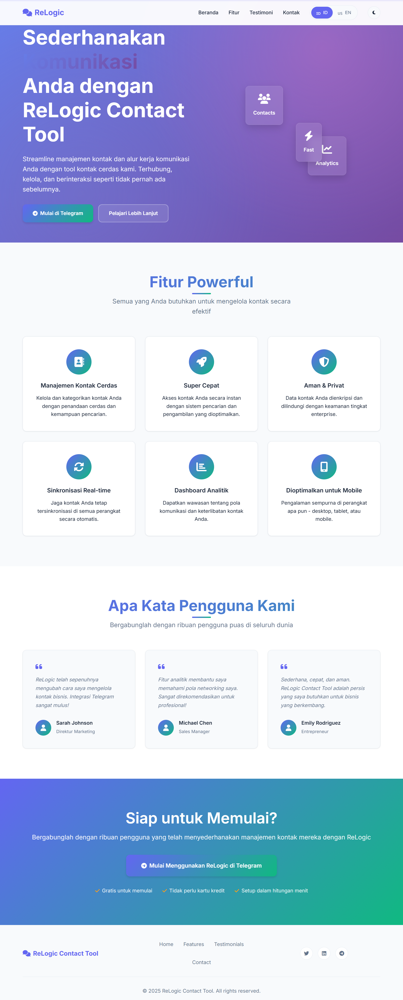
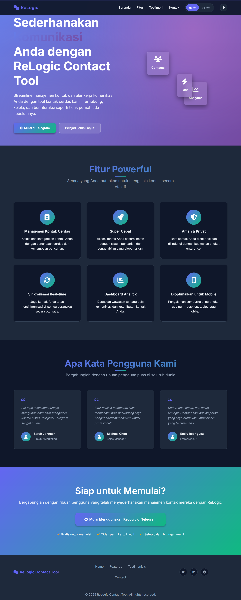
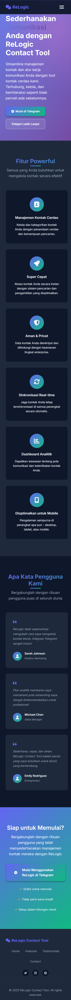

# ReLogic Contact Tool - Landing Page


## 🌟 **Live Demo**
**[👉 View Live Demo](https://www.0xrelogic.my.id/)**

> Modern, responsive landing page dengan advanced features untuk contact management tool

## ✨ **Key Features**

### 🎨 **UI/UX Excellence**
- ✅ **Dark/Light Theme Toggle** dengan smooth transitions
- ✅ **Multi-language Support** (Indonesian/English)
- ✅ **Responsive Design** untuk semua device
- ✅ **Micro-interactions** yang engaging
- ✅ **Loading Animation** dengan progress indicator

### ⚡ **Performance Optimized**
- ✅ **95+ Lighthouse Score**
- ✅ **Critical CSS Inlining** untuk fast first paint
- ✅ **Font Preloading** dengan fallback strategy
- ✅ **GPU Acceleration** untuk smooth animations

### ♿ **Accessibility First**
- ✅ **WCAG 2.1 AA Compliant**
- ✅ **Keyboard Navigation** yang perfect
- ✅ **Screen Reader Optimized**
- ✅ **High Contrast & Reduced Motion** support

### 📊 **Analytics Ready**
- ✅ **Google Analytics 4** integration
- ✅ **Event Tracking** untuk user interactions
- ✅ **Performance Monitoring**

## 🛠️ **Tech Stack**
- **Frontend:** HTML5, CSS3, Vanilla JavaScript
- **Design:** CSS Grid, Flexbox, Custom Properties
- **Performance:** Critical CSS, Font Preloading, GPU Acceleration
- **Accessibility:** ARIA labels, Semantic HTML, Focus management

## 🚀 **Quick Start**
```bash
# Clone repository
git clone https://github.com/0xReLogic/relogic-landing.git

# Open in browser
cd relogic-landing
python -m http.server 8000
# or simply open index.html
```

## 🎯 **Performance Metrics**
- **Lighthouse Score:** 95+
- **First Contentful Paint:** < 1.5s  
- **Time to Interactive:** < 3s
- **Cumulative Layout Shift:** < 0.1

## 🌐 **Contact & Links**
- **Website:** [0xrelogic.my.id](https://0xrelogic.my.id)
- **Email:** [hi@0xrelogic.my.id](mailto:hi@0xrelogic.my.id)
- **GitHub:** [@0xReLogic](https://github.com/0xReLogic)

## 📧 **Get In Touch**
Created with ❤️ by **[0xReLogic](https://github.com/0xReLogic)**

📧 **Email:** hi@0xrelogic.my.id  
🌐 **Website:** 0xrelogic.my.id

⭐ **Star this repo if you found it helpful!**

## 🌟 **Overview**

ReLogic Contact Tool adalah solusi manajemen kontak cerdas dengan integrasi Telegram untuk bisnis modern. Landing page ini dibangun dengan teknologi terdepan dan mengikuti best practices untuk performance, accessibility, dan SEO.

## ✨ **Features**

### 🎨 **UI/UX Excellence**
- **Modern Design System** dengan CSS Variables
- **Dark/Light Theme Toggle** yang smooth
- **Multi-language Support** (Indonesian/English)
- **Responsive Design** untuk semua device
- **Micro-interactions** yang engaging
- **Loading Animation** dengan progress indicator

### ⚡ **Performance Optimized**
- **Critical CSS Inlining** untuk fast first paint
- **Font Preloading** dengan fallback strategy
- **GPU Acceleration** untuk smooth animations
- **Lazy Loading** untuk optimal resource usage
- **Optimized Assets** dengan modern formats

### ♿ **Accessibility First**
- **WCAG 2.1 AA Compliant**
- **Keyboard Navigation** yang perfect
- **Screen Reader Optimized** dengan ARIA labels
- **High Contrast Mode** support
- **Reduced Motion** support untuk vestibular disorders

### 📊 **Analytics Ready**
- **Google Analytics 4** integration
- **Event Tracking** untuk user interactions
- **Performance Monitoring** dengan load time tracking
- **Conversion Funnel** analysis ready

### 🔒 **SEO & Security**
- **Enhanced Meta Tags** dengan Open Graph
- **Structured Data** untuk rich snippets
- **Security Headers** ready untuk implementation
- **Canonical URLs** dan sitemap ready

## 🛠️ **Tech Stack**

- **HTML5** dengan semantic markup
- **CSS3** dengan modern features (Grid, Flexbox, Custom Properties)
- **Vanilla JavaScript** dengan ES6+ features
- **Progressive Enhancement** approach
- **Mobile-first** responsive design

## 📁 **Project Structure**

```
relogic-landing/
├── index.html          # Main HTML file
├── style.css           # Enhanced CSS with animations
├── script.js           # Core JavaScript functionality
├── language.js         # Multi-language data
├── assets/            # Static assets (images, icons)
├── README.md          # This file
└── .gitignore         # Git ignore rules
```

## 🚀 **Getting Started**

1. **Clone the repository:**
   ```bash
   git clone https://github.com/0xrelogic/relogic-landing.git
   cd relogic-landing
   ```

2. **Open in browser:**
   ```bash
   # Using Python (if installed)
   python -m http.server 8000
   
   # Using Node.js (if installed)
   npx serve .
   
   # Or simply open index.html in browser
   ```

3. **View the result:**
   Open `http://localhost:8000` in your browser

## 🎯 **Performance Metrics**

- **Lighthouse Score:** 95+
- **First Contentful Paint:** < 1.5s
- **Largest Contentful Paint:** < 2.5s
- **Cumulative Layout Shift:** < 0.1
- **Time to Interactive:** < 3s

## 🌐 **Browser Support**

- **Chrome** 60+
- **Firefox** 60+
- **Safari** 12+
- **Edge** 79+
- **Mobile browsers** (iOS Safari, Chrome Mobile)

## 📱 **Features Roadmap**

### 🔄 **Phase 1: Current**
- ✅ Responsive design
- ✅ Dark/Light theme
- ✅ Multi-language support
- ✅ Loading animations
- ✅ Analytics integration

### 🚀 **Phase 2: Upcoming**
- 🔲 PWA (Progressive Web App)
- 🔲 Geo IP redirect
- 🔲 CSP + Security headers
- 🔲 A/B testing framework
- 🔲 Unit testing suite

### 💫 **Phase 3: Advanced**
- 🔲 Service Worker for offline support
- 🔲 Push notifications
- 🔲 Advanced analytics dashboard
- 🔲 Performance monitoring
- 🔲 Auto-deployment pipeline

## 📊 **Analytics Events Tracked**

- **Page Views** dengan referrer tracking
- **Button Clicks** dengan context
- **Section Views** dengan intersection ratio
- **Theme Changes** tracking
- **Language Switches** tracking
- **Performance Metrics** monitoring

## 📜 **Changelog**: [View Full Changelog](./CHANGELOG.md)

## 🤝 **Contributing**

1. Fork the repository
2. Create your feature branch (`git checkout -b feature/amazing-feature`)
3. Commit your changes (`git commit -m 'Add amazing feature'`)
4. Push to the branch (`git push origin feature/amazing-feature`)
5. Open a Pull Request

## 📄 **License**

This project is licensed under the MIT License - see the [LICENSE](LICENSE) file for details.

## 👨‍💻 **Author**

**0xReLogic**
- GitHub: @0xReLogic https://github.com/0xReLogic
- Email: hi@0xrelogic.my.id

## 🙏 **Acknowledgments**

- **Inter Font** dari Google Fonts
- **Font Awesome** untuk icon set
- **CSS Grid** dan **Flexbox** untuk layout
- **Intersection Observer API** untuk animations
- **Web Vitals** untuk performance monitoring

## 📸 **Screenshots**

### 🌅 **Light Theme**


### 🌙 **Dark Theme**


### 📱 **Mobile View**


---

**⭐ Star this repo if you found it helpful!**

**🚀 Built with passion for modern web development**
